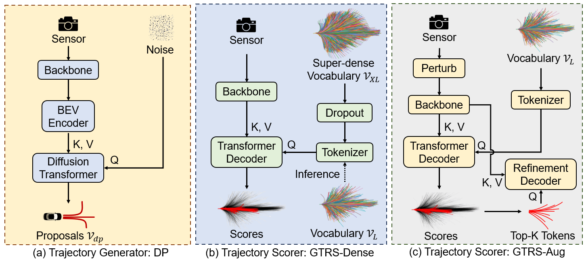

# GTRS: Generalized Trajectory Scoring for End-to-end Multi-modal Planning

### [arXiv](https://arxiv.org/abs/2506.06664) | [Challenge](https://opendrivelab.com/challenge2025/#navsim-e2e-driving)

This is the official repository of GTRS, an end-to-end planning framework featuring a robust trajectory scorer for evaluating diverse trajectory candidates.

## News
🏆GTRS wins the [E2E Driving Track](https://opendrivelab.com/challenge2025/#navsim-e2e-driving) at [CVPR25 Autonomous Grand Challenge](https://opendrivelab.com/challenge2025/).

## TODO
Code and models will be released soon. Stay tuned!

## Citation
TBD

## Acknowledgement
Many thanks to the following great open-source repositories:
+ [NAVSIM](https://github.com/autonomousvision/navsim)
+ [VAD](https://github.com/hustvl/VAD)
+ [Transfuser](https://github.com/autonomousvision/transfuser)